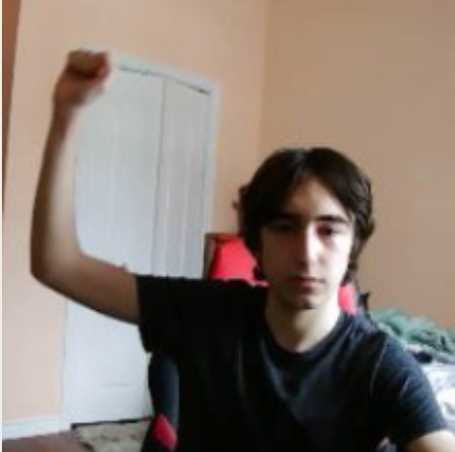
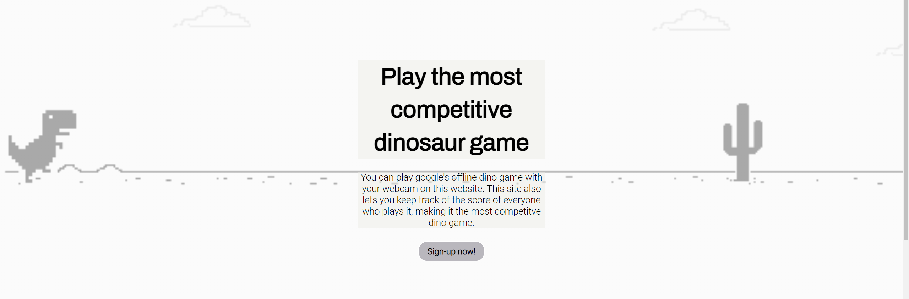
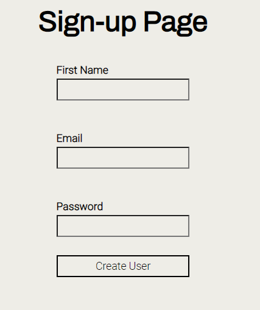
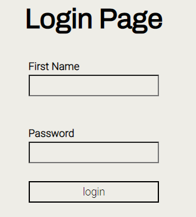
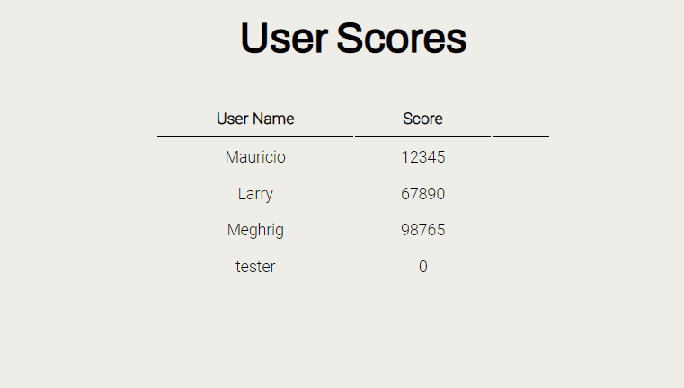
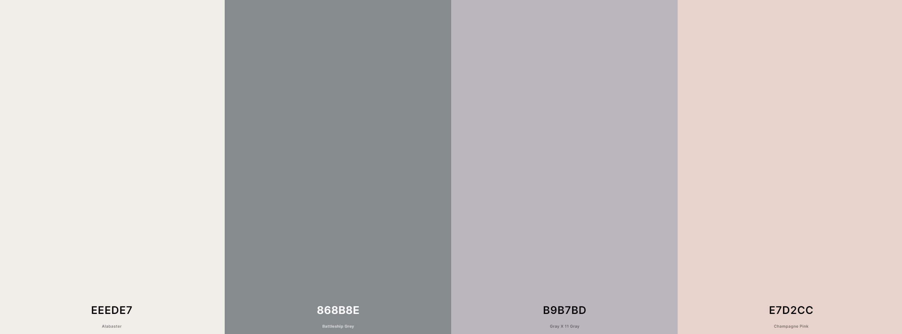
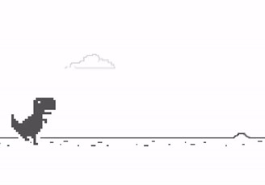
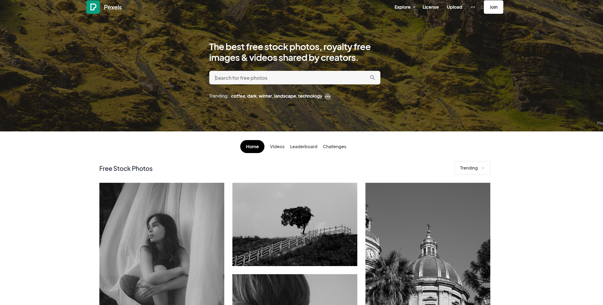

# DinoGameSite
Website made in contribution Robert Cristian Neacsu.
Dino Game remake made in contribution with Liam Kopke.

## Main Concept
This website consists of managing user signup and login and tracking scores for different users.
We remade Google's infamous Dino Game but with a twist, we can control the dinosaur's jumping through our camera, by raising our arm.

To make this work, we used Teachable Machine, a web-based tool used for create machine learning models.
Here is the playable game, since it is not yet fully integrated to the website: https://editor.p5js.org/sebi6547/sketches/cdKsSMB0T.

## Website
The main page of the website consists of basic information about the website and a hero image that represents everything the website is about.

Signup and Login Pages

 

Scores Page

### Website design
Website Name: Dinosaurs and Cacti
Tag Line: Play the most competitive dinosaur game

Color Palette:

Fonts:
- Archivo-Black
- Roboto

Mood Board:

